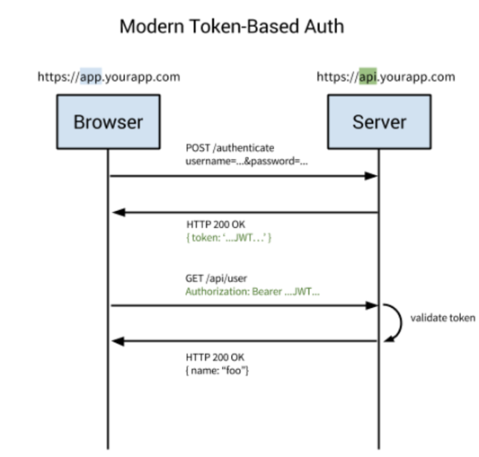
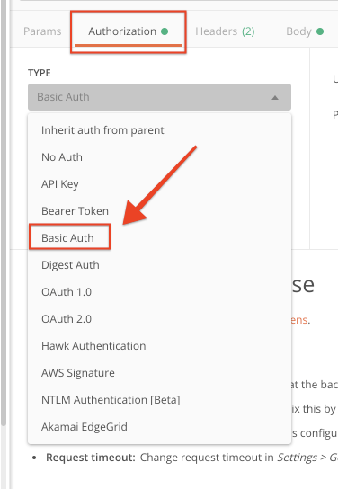
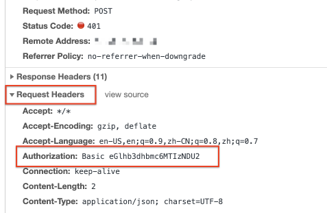
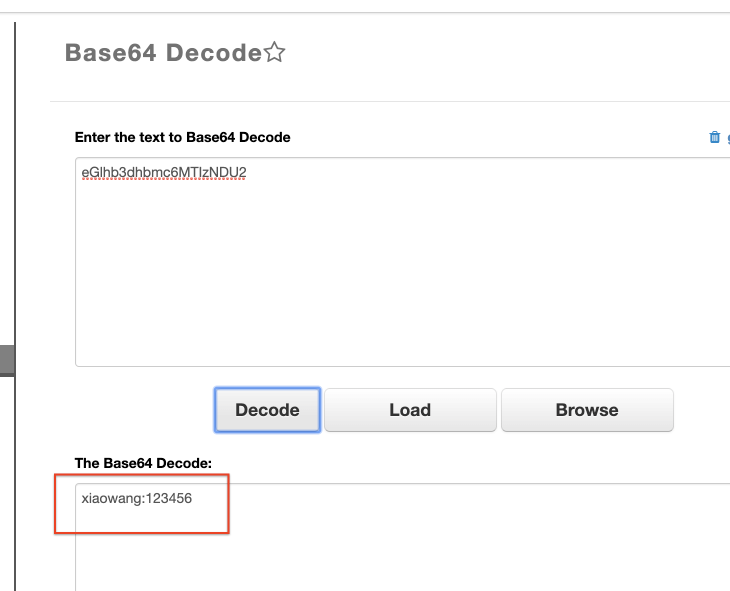

# 用户鉴权之 Basic_Auth 应用策略
> 鉴权 / Spring Security / token

## 一. 用户鉴权是什么？
用户鉴权是发生在客户端和服务器通信时，服务器识别客户端身份的方式，比如一个应用有很多用户，怎样保证用户之间的数据不互相干扰？怎样识别普通用户和管理员用户并分别给到不同的操作权限？这两个问题有一个核心的问题：

服务器是怎样识别用户的？ 即： 服务器是怎样鉴别用户权限的？  

下图是客户端和服务器通信的过程，每一次客户端访问服务器也都有服务器鉴权的过程。  
以最简单的 Basic_Auth 为例：
1. 客户端第一次登陆服务器输入用户名密码
2. 服务器收到用户名密码，到数据库中查询，查询不到，拒绝连接
3. 数据库中查询到用户，服务端生成一个 token，保存在服务端
4. 客户端收到 token 后，保存在cookie / localStorage
5. 客户端以后的每一次请求，都会带上 token
6. 服务器收到 token 后，先查询这个 token 是否存在？是否过期？是否需要刷新？
7. token 验证通过后（此时服务端已经识别了发送这个请求的客户的身份），然后允许 CRUD 操作

为什么要用 token 这样验证？感觉很麻烦？为什么要用这样的鉴权方式？    
- 解决服务器识别客户端身份的问题
- 解决鉴权问题的基础上，免去了每次验证需要用户输入用户名密码的繁琐操作

服务器有多少种鉴别客户端身份的方式？  

从 postman 的鉴权方式看，有这么多种鉴权方式，Basic_Auth 是通过输入用户名密码，最简单的一种～

## 二. Basic_Auth 的详细交互过程

Step 1:
客户端输入用户名密码，postman 中选择 Basic_Auth 鉴权方式，postman 在发送 request 请求时，会使用 base64 转码成一个字符串

同时 base64 转码后的字符串可以在[https://codebeautify.org/base64-decode](https://codebeautify.org/base64-decode)这样的在线网站中解码。  
所以，base64 并不是用来加密的，转码的作用在于方便不可见字符在网络中的完整传输，比如像空格，`\n` 这样的特殊字符，转化成可见的字符串。  

Step 2:

## 三. Basic_Auth 认证的安全性缺点
- token 被盗（https 保护）
- 前后端 token 清除策略

token 作为敏感信息，在浏览器（cookie / localStorage）和服务器（数据库）都会存储，所以 token 发生泄漏会在两个端和传输过程（https 保护，略过）。  

前端 token 清除策略：  

后端 token 清除策略：
- token 存在数据库中，设置定时任务，每隔 1 小时删除 token

# 参考
- [https://juejin.im/post/5d67662ee51d45621655353f](https://juejin.im/post/5d67662ee51d45621655353f)
